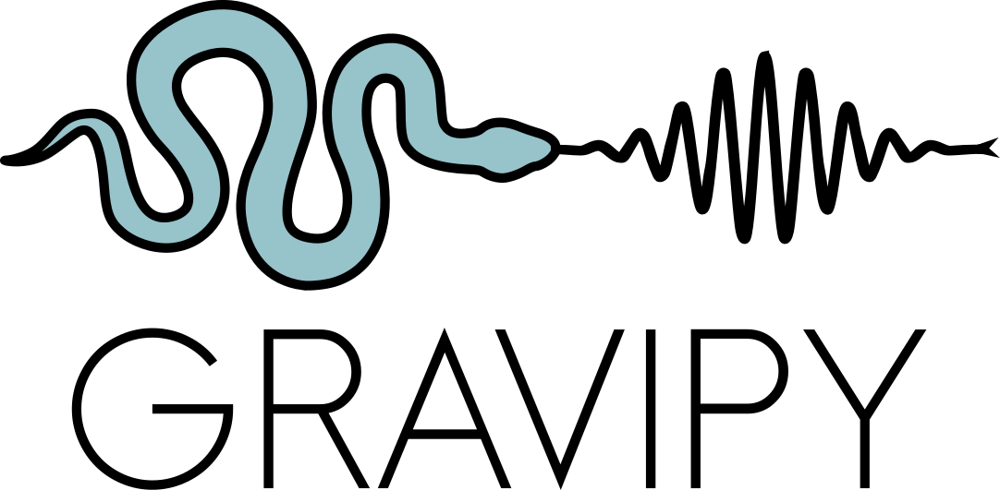

**Gravipy** is a Python library for analysing and modelling interferometric obtained with the GRAVITY instrument.

## About the logo

The package logo was designed by Diogo Ribeiro. <a href="https://www.vecteezy.com/free-vector/snake-icon">Some elements</a> were adapted from vector resources originally sourced from [Vecteezy](https://www.vecteezy.com/).